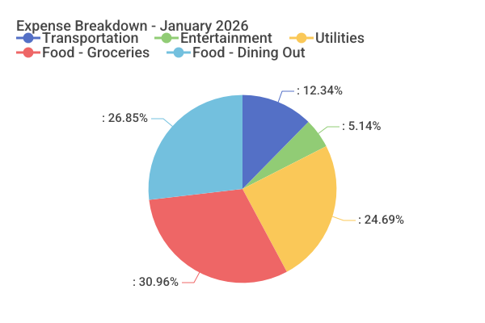

# Expense Bot

[](https://github.com/yelinaung/expense-bot/actions/workflows/ci.yml)

> **Disclaimer**: This application was developed primarily by AI coding agents (Claude/Amp) as an experimental project. While functional, **quality is not guaranteed**. If you choose to use or deploy this bot, please do so with caution, review the code yourself, and understand that it may contain bugs or security issues. Use at your own risk.

A Telegram bot for tracking personal expenses with multi-currency support, AI-powered receipt OCR, and automatic categorization using Google Gemini AI.

## Features

- **Multi-Currency Support**: Track expenses in 17 currencies (USD, EUR, GBP, SGD, JPY, and more)
- **Quick Expense Tracking**: Add expenses with simple text messages like `5.50 Coffee` or `$10 Lunch`
- **AI Auto-Categorization**: Automatically categorizes expenses using Gemini AI (e.g., "vegetables" → "Food - Grocery")
- **Structured Input**: Use commands like `/add 10.50 Lunch Food - Dining Out` for detailed entries
- **Receipt OCR**: Upload receipt photos for automatic expense extraction using Gemini AI
- **Voice Expense Input**: Send voice messages like "spent five fifty on coffee" for hands-free expense entry via Gemini AI
- **Visual Charts**: Generate pie charts showing expense breakdown by category
- **CSV Report Generation**: Export weekly or monthly expense reports in CSV format
- **Category Management**: Organize expenses with predefined or custom categories
- **Expense Queries**: View expenses by time period (today, this week, recent)
- **Expense Editing**: Modify or delete existing expenses with inline buttons
- **User Whitelisting**: Control who can access your bot (by user ID or username)
- **Expense Tags**: Label expenses with hashtags like `#work`, `#travel` for flexible cross-category organization
- **Category Rename/Delete**: Rename categories with `/renamecategory Old -> New` and delete with `/deletecategory`
- **GitLab Releases**: Automated cross-platform releases via GoReleaser on both GitHub and GitLab
- **Draft Management**: Automatic cleanup of unconfirmed draft expenses
- **Category Caching**: Performance-optimized category lookups

## Architecture

```
expense-bot/
├── docs/                   # Documentation
│   ├── examples/          # Sample files
│   ├── PRIVACY.md         # Privacy policy
│   ├── SCALABILITY.md     # Scaling guide
│   └── ...                # Other docs
├── internal/
│   ├── bot/               # Telegram bot handlers and logic
│   │   ├── handlers_commands.go    # Command handlers (/start, /add, /list, etc.)
│   │   ├── handlers_receipt.go     # Receipt/photo processing
│   │   ├── handlers_callbacks.go   # Callback query handlers
│   │   ├── handlers_tags.go         # Tag management commands
│   │   ├── parser.go              # Expense input parsing
│   │   └── category_matcher.go    # Smart category matching
│   ├── config/            # Configuration management
│   ├── database/          # Database schema and migrations
│   ├── gemini/            # Google Gemini API integration
│   ├── logger/            # Structured logging
│   ├── models/            # Domain models
│   └── repository/        # Data access layer
├── .gitlab-ci.yml         # CI/CD pipeline
├── Makefile              # Development commands
└── docker-compose.test.yml # Test database setup
```

### Technology Stack

- **Language**: Go 1.25+
- **Database**: PostgreSQL with pgx driver
- **Bot Framework**: go-telegram/bot
- **AI/OCR**: Google Gemini API (gemini-2.5-flash model)
- **Testing**: testify, table-driven tests, parallel execution
- **CI/CD**: GitLab CI + GitHub Actions with linting, SAST, coverage enforcement, and GoReleaser

## Prerequisites

- Go 1.25 or higher
- PostgreSQL 18+
- Telegram Bot Token (from [@BotFather](https://t.me/BotFather))
- Google Gemini API Key (optional, for receipt OCR and auto-categorization)
- Docker and Docker Compose (for testing)

## Installation

### 1. Clone the Repository

```bash
git clone <repository-url>
cd expense-bot
```

### 2. Install Dependencies

```bash
go mod download
```

### 3. Set Up Environment Variables

Copy the example environment file:

```bash
cp .env.example .env
```

Edit `.env` with your configuration:

```bash
# Telegram Bot Token (get from @BotFather)
TELEGRAM_BOT_TOKEN=your_bot_token_here

# PostgreSQL Database Connection
DATABASE_URL=postgres://YOUR_DATABASE_URL

# Whitelisted Telegram User IDs (comma-separated)
# Get your user ID by messaging @userinfobot
WHITELISTED_USER_IDS=123456789,987654321

# Whitelisted Telegram Usernames (comma-separated, optional)
# Alternative to user IDs, accepts with or without @ prefix
WHITELISTED_USERNAMES=alice,bob,@charlie

# Hash salt for privacy-preserving logging (generate with: openssl rand -hex 32)
# Must be at least 32 characters
LOG_HASH_SALT=generate_random_64_char_hex_string_here

# Gemini API Key (optional - enables receipt OCR and auto-categorization)
# Get from https://aistudio.google.com/app/apikey
GEMINI_API_KEY=your_gemini_api_key_here

# Daily reminder settings (optional)
DAILY_REMINDER_ENABLED=false
REMINDER_HOUR=20
REMINDER_TIMEZONE=Asia/Singapore
```

### 4. Set Up Database

Create a PostgreSQL database:

```sql
CREATE DATABASE expense_bot;
```

The bot will automatically run migrations on startup, creating:
- `users` table - Telegram user information
- `categories` table - Expense categories
- `expenses` table - Expense records

Default categories will be seeded automatically.

### 5. Build and Run

```bash
# Build the bot
make build

# Run the bot
./bin/expense-bot
```

Or run directly:

```bash
go run main.go
```

## Usage

### Basic Commands

| Command | Description | Example |
|---------|-------------|---------|
| `/start` | Welcome message and quick start guide | `/start` |
| `/help` | Show all available commands | `/help` |
| `/add <amount> <description> [category]` | Add a structured expense | `/add 5.50 Coffee Food - Dining Out` |
| `/list` | Show recent expenses (last 10) | `/list` |
| `/today` | Show today's expenses with total | `/today` |
| `/week` | Show this week's expenses with total | `/week` |
| `/category <name>` | Filter expenses by category | `/category Food - Dining Out` |
| `/report week` | Generate weekly expense report (CSV) | `/report week` |
| `/report month` | Generate monthly expense report (CSV) | `/report month` |
| `/chart week` | Generate weekly expense pie chart | `/chart week` |
| `/chart month` | Generate monthly expense pie chart | `/chart month` |
| `/categories` | List all expense categories | `/categories` |
| `/edit <id> <amount> <description> [category]` | Edit an expense | `/edit 42 6.00 Coffee Food - Dining Out` |
| `/delete <id>` | Delete an expense | `/delete 42` |
| `/currency` | Show your default currency | `/currency` |
| `/setcurrency <code>` | Set your default currency | `/setcurrency USD` |
| `/addcategory <name>` | Create a new category | `/addcategory Food - Dining Out` |
| `/renamecategory Old -> New` | Rename a category | `/renamecategory Dining -> Food - Dining Out` |
| `/deletecategory <name>` | Delete a category (expenses become uncategorized) | `/deletecategory Old Category` |
| `/tag <id> #tag1 [#tag2] ...` | Add tags to an expense | `/tag 1 #work #meeting` |
| `/untag <id> #tag` | Remove a tag from an expense | `/untag 1 #work` |
| `/tags [#name]` | List all tags or filter expenses by tag | `/tags #work` |

### Admin Commands

> These commands are available to superadmins only.

| Command | Description | Example |
|---------|-------------|---------|
| `/approve <user_id\|@username>` | Approve a user by Telegram ID or username | `/approve @alice` |
| `/revoke <user_id\|@username>` | Revoke an approved user by ID or username | `/revoke 123456789` |
| `/users` | List superadmins and approved users | `/users` |

### Multi-Currency Support

Track expenses in 17 different currencies with flexible input formats:

**Supported Currencies:**
- USD ($), EUR (€), GBP (£), SGD (S$), JPY (¥), CNY (¥)
- MYR (RM), THB (฿), IDR (Rp), PHP (₱), VND (₫), KRW (₩)
- INR (₹), AUD (A$), NZD (NZ$), HKD (HK$), TWD (NT$)

**Setting Your Default Currency:**
```
/setcurrency USD     # Set default to US Dollars
/currency            # View current default
```

**Using Currency in Expenses:**
```
$10 Coffee           # USD with symbol
€5.50 Lunch          # EUR with symbol
S$15 Taxi            # SGD with symbol
50 Dinner THB        # Thai Baht with suffix code
SGD 25 Groceries     # SGD with prefix code
10.50 Tea            # Uses your default currency
```

The bot automatically detects currency from symbols (€, $, £, etc.) or 3-letter codes (USD, EUR, SGD). If no currency is specified, it uses your default currency (SGD by default).

### Quick Expense Entry

Simply send a message in the format `<amount> <description> [category]`:

```
5.50 Coffee                    # Uses your default currency
$10 Lunch                      # USD
€25 Dinner Food - Dining Out   # EUR with category
50 THB Taxi                    # Thai Baht
5.9 vegetables                 # Auto-categorized as "Food - Grocery"
5.50 Coffee #work              # With inline tag
10 Lunch #team #client         # Multiple tags
```

**Smart Category Matching:**
1. **Manual Category**: If you specify a category (e.g., "Lunch Food - Dining Out"), the bot matches it intelligently
2. **AI Auto-Categorization**: If no category is specified and Gemini API is configured, the bot automatically suggests the best category
   - Example: "5.9 vegetables" → automatically categorized as "Food - Grocery"
   - Example: "15 taxi" → automatically categorized as "Transportation"
   - Only applies suggestions with >50% confidence
3. **Uncategorized**: If neither manual nor AI categorization works, expense is saved as "Uncategorized"

### Receipt OCR

Send a photo of a receipt to automatically extract:
- Amount
- Description/merchant name
- Suggested category (AI-powered)

After extraction, you can:
- ✅ Confirm - Save the expense
- ✏️ Edit - Modify amount, description, or category
- ❌ Cancel - Discard the draft

### Voice Expense Input

Send a voice message describing your expense to add it hands-free:

```
"spent five fifty on coffee"
"ten dollars for lunch"
"twenty bucks taxi to airport"
```

The bot uses Gemini AI to extract the amount, description, currency, and suggested category from your voice. Requires `GEMINI_API_KEY` to be configured.

### CSV Report Generation

Export your expenses as CSV files for analysis in Excel, Google Sheets, or other tools:

```
/report week   # Generate report for current week (Monday-Sunday)
/report month  # Generate report for current month
```

Reports include:
- Expense ID, Date, Amount, Currency, Description, Category
- Total expenses and count in caption
- Filename with date range (e.g., `expenses_month_2026-01.csv`)

### Visual Expense Charts

Generate pie charts showing expense breakdown by category:

```
/chart week   # Generate pie chart for current week (Monday-Sunday)
/chart month  # Generate pie chart for current month
```

**Example Output:**



Charts include:
- Visual breakdown of expenses by category
- Percentage distribution for each category
- Total expenses and count in caption
- PNG image format for easy sharing

### AI Auto-Categorization

When you add an expense without specifying a category, the bot uses Gemini AI to automatically suggest the most appropriate category:

**How it works:**
1. Analyzes expense description (e.g., "vegetables", "taxi", "coffee")
2. Compares against available categories
3. Returns category with confidence score and reasoning
4. Only applies if confidence >50%

**Examples:**
- `5.9 vegetables` → "Food - Grocery" (confidence: 100%)
- `5 bee hoon` → "Food - Dining Out" (confidence: 95%)
- `9 mixed rice` → "Food - Dining Out" (confidence: 95%)
- `15 taxi` → "Transportation" (confidence: 98%)

**Features:**
- Smart distinction between "Food - Dining Out" (prepared meals) and "Food - Grocery" (ingredients)
- Comprehensive logging for debugging
- Fallback to uncategorized if AI fails or confidence is low

### Category Matching

The bot uses intelligent category matching:
- Case-insensitive matching
- Partial word matching (e.g., "food" matches "Food - Dining Out")
- Significant word extraction (ignores common words like "the", "a", "and")

## Development

### Available Make Commands

```bash
# Build the application
make build

# Run all tests
make test

# Run tests with coverage report
make test-coverage

# Run tests with race detection
make test-race

# Run integration tests (requires Docker)
make test-integration

# Run linter
make lint

# Format code
make fmt

# Clean build artifacts
make clean

# View HTML coverage report
make coverage-html
```

### Running Tests

**Unit tests only:**
```bash
make test
```

**Integration tests with PostgreSQL:**
```bash
make test-integration
```

This will:
1. Start a PostgreSQL container via Docker Compose
2. Run all tests with coverage
3. Generate coverage report
4. Shut down the test database

**Manual integration testing:**
```bash
# Start test database
make test-db-up

# Run tests with TEST_DATABASE_URL set
TEST_DATABASE_URL="postgres://YOUR_DATABASE_URL" go test -v ./...

# Stop test database
make test-db-down
```

### Code Quality

The project uses:
- **golangci-lint** - 28 linters enabled for code quality
- **gofumpt** - Stricter formatting than gofmt
- **Pre-commit hooks** - Automatic formatting, linting, and testing
- **GitLab CI + GitHub Actions** - Automated testing, SAST, and coverage enforcement (50% minimum)

### Project Standards

- **Error Handling**: All errors wrapped with context using `fmt.Errorf` and `%w`
- **Logging**: Structured logging with zerolog
- **Testing**: Table-driven tests with parallel execution where possible
- **SQL Safety**: All queries use parameterized statements
- **Concurrency**: Proper mutex usage for shared state (`pendingEdits`, `categoryCache`)

## Configuration

### Environment Variables

| Variable | Required | Description | Default |
|----------|----------|-------------|---------|
| `TELEGRAM_BOT_TOKEN` | Yes | Telegram bot API token | - |
| `DATABASE_URL` | Yes | PostgreSQL connection string | - |
| `WHITELISTED_USER_IDS` | Yes* | Comma-separated Telegram user IDs | - |
| `WHITELISTED_USERNAMES` | Yes* | Comma-separated Telegram usernames | - |
| `LOG_HASH_SALT` | Yes | Random string for privacy-preserving logging (min 32 chars) | - |
| `GEMINI_API_KEY` | No | Google Gemini API key for OCR and auto-categorization | - |
| `LOG_LEVEL` | No | Log level (debug, info, warn, error) | info |
| `DAILY_REMINDER_ENABLED` | No | Enable daily reminders for users without expenses (`true`/`false`) | false |
| `REMINDER_HOUR` | No | Hour of day to send reminders (0-23) | 20 |
| `REMINDER_TIMEZONE` | No | IANA timezone for reminder scheduling and display | Asia/Singapore |

*At least one of `WHITELISTED_USER_IDS` or `WHITELISTED_USERNAMES` is required.

Generate `LOG_HASH_SALT`:
```bash
openssl rand -hex 32
```

### Bot Configuration

- **Draft Expiration**: 10 minutes (auto-cleanup)
- **Draft Cleanup Interval**: 5 minutes
- **Category Cache TTL**: 5 minutes

## Database Schema

### Users Table
- `id` (BIGINT, PK) - Telegram user ID
- `username`, `first_name`, `last_name` - User info
- `created_at`, `updated_at` - Timestamps

### Categories Table
- `id` (SERIAL, PK) - Category ID
- `name` (TEXT, UNIQUE) - Category name
- `created_at` - Timestamp

### Expenses Table
- `id` (SERIAL, PK) - Expense ID
- `user_id` (BIGINT, FK) - References users
- `amount` (DECIMAL) - Expense amount
- `currency` (TEXT) - Currency code
- `description` (TEXT) - Description
- `category_id` (INT, FK) - References categories
- `receipt_file_id` (TEXT) - Telegram file ID
- `status` (TEXT) - 'draft' or 'confirmed'
- `created_at`, `updated_at` - Timestamps

**Indexes**: user_id, created_at, category_id, status

### Tags Table
- `id` (SERIAL, PK) - Tag ID
- `name` (TEXT, UNIQUE) - Tag name (lowercase, letter-start, max 30 chars)
- `created_at` - Timestamp

### Expense Tags Table (Junction)
- `expense_id` (INT, FK) - References expenses (CASCADE)
- `tag_id` (INT, FK) - References tags (CASCADE)
- Primary key: (expense_id, tag_id)

## Troubleshooting

### Bot not responding

1. Check bot is running: `ps aux | grep expense-bot`
2. Verify token: Test with `curl https://api.telegram.org/bot<TOKEN>/getMe`
3. Check logs for errors
4. Ensure your user ID is in `WHITELISTED_USER_IDS`

### Database connection errors

1. Verify PostgreSQL is running: `psql -U user -d expense_bot`
2. Check `DATABASE_URL` format
3. Ensure database exists and user has permissions

### Receipt OCR not working

1. Verify `GEMINI_API_KEY` is set correctly
2. Check logs for Gemini API errors
3. Ensure image is clear and receipt is visible
4. Check Google AI Studio quota limits

### Auto-categorization not working

1. Verify `GEMINI_API_KEY` is configured
2. Check logs for "SuggestCategory" debug messages
3. Common issues:
   - Response truncated: Check MaxOutputTokens (should be 500)
   - Preamble responses: extractJSON() should handle this
   - Low confidence: Only applies if confidence >50%
4. Expenses will be saved as "Uncategorized" if AI fails

## Contributing

### Development Setup

1. Install pre-commit hooks:
   ```bash
   pip install pre-commit
   pre-commit install
   ```

2. Run tests before committing:
   ```bash
   make test-coverage
   make lint
   ```

### Commit Guidelines

- Fix bugs: Use `/commit` with clear description
- Add features: Create feature branch, test thoroughly
- Follow existing code patterns
- Maintain test coverage above 50%

### Testing Requirements

- Unit tests for all new functions
- Integration tests for database operations
- Table-driven tests for multiple scenarios
- Use `t.Parallel()` where appropriate

## Performance

- **Category Caching**: Categories cached for 5 minutes, reducing database queries
- **Connection Pooling**: pgxpool for efficient PostgreSQL connections
- **Parallel Tests**: Tests run in parallel for faster CI/CD
- **Indexed Queries**: All common queries use database indexes

## Security

This application has undergone security hardening. See the [Security Documentation](#security-documentation) for detailed assessments.

### Security Measures Implemented

**Input Validation & Sanitization:**
- SQL injection prevention via parameterized queries (pgx)
- Prompt injection mitigations for AI/LLM inputs (see [PROMPT_INJECTION_SECURITY_ASSESSMENT.md](./docs/PROMPT_INJECTION_SECURITY_ASSESSMENT.md))
- Input sanitization for expense descriptions (quote escaping, newline removal, length limits)
- Fuzz testing for parsing and sanitization functions (see [FUZZ_TESTING_PLAN.md](./docs/FUZZ_TESTING_PLAN.md))

**Authentication & Access Control:**
- User whitelisting by Telegram user ID or username
- Startup validation requires at least one whitelisted user
- All requests rejected by default (fail-closed)

**Configuration Security:**
- Required environment variables validated at startup (fail-fast)
- No insecure defaults (see [INSECURE_DEFAULTS_AUDIT.md](./docs/INSECURE_DEFAULTS_AUDIT.md))
- `LOG_HASH_SALT` required (minimum 32 characters) for privacy-preserving logging

**Privacy-Preserving Logging:**
- User IDs hashed in logs (SHA256-based, salted)
- Expense descriptions redacted in logs
- No PII stored in application logs (see [PRIVACY_LOGGING.md](./docs/PRIVACY_LOGGING.md))

**CI/CD Security:**
- SAST scanning enabled in GitLab CI
- Secrets detection in pipeline
- Dependency vulnerability scanning
- Code coverage enforcement (50% minimum)

**LLM/AI Security:**
- Gemini API response schema validation (enum constraints)
- Confidence score validation (0.0-1.0 range)
- Output sanitization for AI-generated content

### Security Documentation

| Document | Description |
|----------|-------------|
| [PROMPT_INJECTION_SECURITY_ASSESSMENT.md](./docs/PROMPT_INJECTION_SECURITY_ASSESSMENT.md) | AI prompt injection vulnerability analysis and mitigations |
| [INSECURE_DEFAULTS_AUDIT.md](./docs/INSECURE_DEFAULTS_AUDIT.md) | Audit of fail-open vulnerabilities and insecure defaults |
| [FUZZ_TESTING_PLAN.md](./docs/FUZZ_TESTING_PLAN.md) | Fuzz testing strategy for parsing functions |
| [PRIVACY_LOGGING.md](./docs/PRIVACY_LOGGING.md) | Privacy-preserving logging guidelines |
| [PRIVACY.md](./docs/PRIVACY.md) | Privacy policy for receipt photos and user data |
| [MVSP_ASSESSMENT.md](./docs/MVSP_ASSESSMENT.md) | Minimum Viable Secure Product assessment |

### Known Limitations

- No external penetration testing performed
- Designed for personal/small group use, not enterprise
- No formal vulnerability disclosure policy (contributions welcome)

## Monitoring

The bot uses structured logging with zerolog. All operations log:
- User actions with user_id and username
- Command execution with parameters
- Errors with full context
- Performance metrics (cache hits, query times)

## License

See LICENSE file for details.

## Documentation

Additional documentation is available in the [`docs/`](./docs) directory:

- **[Privacy Policy](./docs/PRIVACY.md)** - How receipt photos and user data are processed
- **[Scalability Guide](./docs/SCALABILITY.md)** - Scaling strategies and multi-instance deployment
- **[Development Agents](./AGENTS.md)** - Claude Code AI agents used in development
- **[Coverage Improvement Plan](./docs/COVERAGE_IMPROVEMENT_PLAN.md)** - Test coverage strategy
- **[Phase 1 Progress](./docs/PHASE1_PROGRESS.md)** - Testing milestone achievements

## Support

For issues, questions, or contributions, please open an issue in the repository.
