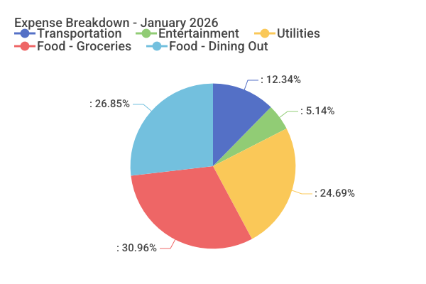

# Expense Bot

[](https://github.com/yelinaung/expense-bot/actions/workflows/ci.yml)
[](https://sonarcloud.io/summary/new_code?id=yelinaung_expense-bot)
[](https://codecov.io/github/yelinaung/expense-bot)

> [!IMPORTANT]
> **Disclaimer**: AI coding agents (Claude/Amp) wrote most of this application as an experiment. It works, but **nobody guarantees its quality**. Read the code before you deploy it, expect bugs and possible security holes, and run it at your own risk.

A Telegram bot for tracking personal expenses. Send it `5.50 Coffee` and it saves the expense. It reads 17 currencies, extracts amounts from receipt photos and voice messages, sorts spending into categories with Google Gemini, and exports reports as CSV or pie charts.

## Features

- **Multi-currency**: Record expenses in 17 currencies (USD, EUR, GBP, SGD, JPY, and more)
- **Quick entry**: Text the bot `5.50 Coffee`, `Coffee 5.50`, or `$10 Lunch`
- **AI categorization**: Gemini picks the category — "vegetables" lands in "Food - Grocery"
- **Structured entry**: `/add 10.50 Lunch Food - Dining Out` when you want to be explicit
- **Receipt OCR**: Photograph a receipt and Gemini extracts the expense
- **Voice input**: Say "spent five fifty on coffee" and Gemini turns it into an expense
- **Charts**: Pie charts of spending by category
- **CSV reports**: Weekly or monthly exports
- **Timezone-accurate periods**: `/today`, `/week`, `/report`, and `/chart` compute date ranges and filenames in your configured display timezone
- **Categories**: Predefined or your own, renameable and deletable
- **Queries**: Expenses for today, this week, or the last ten
- **Editing**: Change or delete an expense through inline buttons
- **Reflection**: Walk through expenses with `/review`, summarize habits with `/habit`
- **Whitelisting**: Only the user IDs or usernames you list can talk to the bot
- **Tags**: Hashtags like `#work` and `#travel` cut across categories
- **Automated releases**: GoReleaser publishes cross-platform builds to GitHub and GitLab
- **Draft cleanup**: Unconfirmed drafts expire on their own
- **Category cache**: Category lookups hit memory, not the database
- **OpenTelemetry**: Optional traces and metrics for handlers, background jobs, DB calls, and external APIs

## Architecture

```
expense-bot/
├── docs/                   # Documentation (privacy, scalability, testing, OTel)
│   ├── examples/           # Sample files
│   ├── OTEL_INTEGRATION.md # OpenTelemetry integration notes
│   ├── PRIVACY.md          # Privacy policy
│   └── SCALABILITY.md      # Scaling guide
├── internal/
│   ├── bot/                # Telegram bot core, handlers, parsers, report/chart generators
│   │   ├── bot.go
│   │   ├── handlers_commands.go
│   │   ├── handlers_receipt.go
│   │   ├── handlers_voice.go
│   │   ├── handlers_chart.go
│   │   ├── parser.go
│   │   ├── csv_generator.go
│   │   └── date_range.go
│   ├── config/             # Environment config parsing and validation
│   ├── database/           # DB connection and migrations
│   ├── exchange/           # FX client + cached conversion service
│   ├── gemini/             # Gemini client, receipt/voice parsing, category suggestion
│   ├── logger/             # Structured logging + privacy-safe hashing
│   ├── models/             # Domain models
│   ├── repository/         # Data access layer
│   └── telemetry/          # OpenTelemetry init, middleware, metrics, HTTP transport
├── main.go                 # Application entrypoint
├── mise.toml               # Canonical development tasks
├── docker-compose.test.yml # Test database setup
└── .gitlab-ci.yml          # CI/CD pipeline
```

### Technology Stack

- **Language**: Go 1.27+
- **Database**: PostgreSQL with pgx driver
- **Bot Framework**: go-telegram/bot
- **AI/OCR**: Google Gemini API (gemini-2.5-flash model)
- **Testing**: testify, table-driven tests, parallel execution
- **CI/CD**: GitLab CI + GitHub Actions with linting, SAST, coverage enforcement, and GoReleaser

## Prerequisites

- Go 1.27 or higher
- PostgreSQL 18+
- Telegram Bot Token (from [@BotFather](https://t.me/BotFather))
- Google Gemini API Key (optional, for receipt OCR and auto-categorization)
- Docker and Docker Compose (for testing)

## Installation

### 1. Clone the Repository

```bash
git clone https://github.com/yelinaung/expense-bot
cd expense-bot
```

### 2. Install Dependencies

```bash
mise trust mise.toml
mise install
go mod download
```

### 3. Set Up Environment Variables

Copy the example environment file:

```bash
cp .env.example .env
```

Edit `.env` with your configuration:

```bash
# Telegram Bot Token (get from @BotFather)
TELEGRAM_BOT_TOKEN=your_bot_token_here

# PostgreSQL Database Connection
DATABASE_URL=postgres://YOUR_DATABASE_URL

# Whitelisted Telegram User IDs (comma-separated)
# Get your user ID by messaging @userinfobot
WHITELISTED_USER_IDS=123456789,987654321

# Whitelisted Telegram Usernames (comma-separated, optional)
# Alternative to user IDs, accepts with or without @ prefix
WHITELISTED_USERNAMES=alice,bob,@charlie

# Allowed chat/group IDs (optional). If set, bot only responds in these chats.
# Supergroup IDs are typically negative, e.g. -1001234567890
ALLOWED_CHAT_IDS=-1001234567890

# Hash salt for privacy-preserving logging (generate with: openssl rand -hex 32)
# Must be at least 32 characters
LOG_HASH_SALT=generate_random_64_char_hex_string_here

# Gemini API Key (optional - enables receipt OCR and auto-categorization)
# Get from https://aistudio.google.com/app/apikey
GEMINI_API_KEY=your_gemini_api_key_here

# Exchange rate settings (optional - used for automatic currency conversion)
EXCHANGE_RATE_BASE_URL=https://api.frankfurter.app
EXCHANGE_RATE_TIMEOUT=5s
EXCHANGE_RATE_CACHE_TTL=12h

# Daily reminder settings (optional)
DAILY_REMINDER_ENABLED=false
REMINDER_HOUR=20
REMINDER_TIMEZONE=Asia/Singapore

# Weekly report settings (optional)
WEEKLY_REPORT_ENABLED=false
WEEKLY_REPORT_DAY=1
WEEKLY_REPORT_HOUR=9
# Requires WEEKLY_REPORT_ENABLED=true; the recap is sent with the weekly report
WEEKLY_HABIT_RECAP_ENABLED=false

# OpenTelemetry settings (optional)
OTEL_ENABLED=false
OTEL_SERVICE_NAME=expense-bot
OTEL_ENVIRONMENT=production
OTEL_EXPORTER_TYPE=otlp-grpc
# Leave empty to use defaults:
# - otlp-grpc: localhost:4317
# - otlp-http: http://localhost:4318
OTEL_EXPORTER_OTLP_ENDPOINT=
OTEL_EXPORTER_OTLP_INSECURE=false
OTEL_TRACE_SAMPLE_RATE=1.0
```

### 4. Set Up Database

Create a PostgreSQL database:

```sql
CREATE DATABASE expense_bot;
```

The bot runs migrations on startup and creates three tables:
- `users` — Telegram user information
- `categories` — expense categories
- `expenses` — expense records

It seeds the default categories on the same run.

### 5. Build and Run

```bash
# Build the bot
mise run build

# Run the bot
./bin/expense-bot
```

Or run directly:

```bash
go run main.go
```

## Usage

### Basic Commands

| Command | Description | Example |
|---------|-------------|---------|
| `/start` | Welcome message and quick start guide | `/start` |
| `/help` | Show all available commands | `/help` |
| `/add <amount> <description> [category]` | Add a structured expense | `/add 5.50 Coffee Food - Dining Out` |
| `/list` | Show recent expenses (last 10) | `/list` |
| `/today` | Show today's expenses with total | `/today` |
| `/week` | Show this week's expenses with total | `/week` |
| `/review` | Review confirmed expenses one at a time | `/review` |
| `/habit [week\|month\|90d]` | Summarize spending reflection habits | `/habit month` |
| `/category <name>` | Filter expenses by category | `/category Food - Dining Out` |
| `/report week` | Generate weekly expense report (CSV) | `/report week` |
| `/report month` | Generate monthly expense report (CSV) | `/report month` |
| `/chart week` | Generate weekly expense pie chart | `/chart week` |
| `/chart month` | Generate monthly expense pie chart | `/chart month` |
| `/categories` | List all expense categories | `/categories` |
| `/edit <id> <amount> <description> [category]` | Edit an expense | `/edit 42 6.00 Coffee Food - Dining Out` |
| `/delete <id>` | Delete an expense | `/delete 42` |
| `/currency` | Show your default currency | `/currency` |
| `/setcurrency <code>` | Set your default currency | `/setcurrency USD` |
| `/addcategory <name>` | Create a new category | `/addcategory Food - Dining Out` |
| `/renamecategory Old -> New` | Rename a category | `/renamecategory Dining -> Food - Dining Out` |
| `/deletecategory <name>` | Delete a category (expenses become uncategorized) | `/deletecategory Old Category` |
| `/tag <id> #tag1 [#tag2] ...` | Add tags to an expense | `/tag 1 #work #meeting` |
| `/untag <id> #tag` | Remove a tag from an expense | `/untag 1 #work` |
| `/tags [#name]` | List all tags or filter expenses by tag | `/tags #work` |

### Admin Commands

> Superadmins only.

| Command | Description | Example |
|---------|-------------|---------|
| `/approve <user_id\|@username>` | Approve a user by Telegram ID or username | `/approve @alice` |
| `/revoke <user_id\|@username>` | Revoke an approved user by ID or username | `/revoke 123456789` |
| `/users` | List superadmins and approved users | `/users` |

### Multi-Currency Support

Seventeen currencies, several input formats.

**Supported Currencies:**
- USD ($), EUR (€), GBP (£), SGD (S$), JPY (¥), CNY (¥)
- MYR (RM), THB (฿), IDR (Rp), PHP (₱), VND (₫), KRW (₩)
- INR (₹), AUD (A$), NZD (NZ$), HKD (HK$), TWD (NT$)

**Setting Your Default Currency:**
```
/setcurrency USD     # Set default to US Dollars
/currency            # View current default
```

**Using Currency in Expenses:**
```
$10 Coffee           # USD with symbol
€5.50 Lunch          # EUR with symbol
S$15 Taxi            # SGD with symbol
50 Dinner THB        # Thai Baht with suffix code
SGD 25 Groceries     # SGD with prefix code
10.50 Tea            # Uses your default currency
```

The bot reads the currency from a symbol (€, $, £) or a 3-letter code (USD, EUR, SGD). Leave it out and it uses your default, which starts at SGD.

Enter a currency other than your default and the bot converts it before saving, then notes the original amount on the description:

```text
Valentine roses [orig: 18.00 USD -> 24.30 SGD @ 1.3500 (2026-02-14)]
```

### Quick Expense Entry

Send a message shaped like `<amount> <description> [category]`:

```
5.50 Coffee                    # Uses your default currency
Coffee 5.50                    # Description-first format
$10 Lunch                      # USD
€25 Dinner Food - Dining Out   # EUR with category
50 THB Taxi                    # Thai Baht
Lunch usd 12 #team             # Description-first, lowercase currency, tags
5.9 vegetables                 # Auto-categorized as "Food - Grocery"
5.50 Coffee #work              # With inline tag
10 Lunch #team #client         # Multiple tags
```

**How the bot picks a category:**
1. If you name a category (e.g. `Lunch Food - Dining Out`), the bot matches it against your existing categories.
2. If you don't and a Gemini API key is set, the bot suggests one — `5.9 vegetables` becomes "Food - Grocery", `15 taxi` becomes "Transportation". It only applies a suggestion above 50% confidence.
3. When nothing matches, the expense lands in `Others` if that category exists, otherwise "Uncategorized".

### Receipt OCR

Send a photo of a receipt and the bot pulls out:
- Amount
- Description or merchant name
- A suggested category

Then you can:
- ✅ Confirm - Save the expense
- ✏️ Edit - Modify amount, description, or category
- ❌ Cancel - Discard the draft

### Voice Expense Input

Record a voice message and skip typing:

```
"spent five fifty on coffee"
"ten dollars for lunch"
"twenty bucks taxi to airport"
```

Gemini transcribes the message and pulls out the amount, description, currency, and a category. Needs `GEMINI_API_KEY`.

### CSV Report Generation

Export expenses as CSV for Excel, Google Sheets, or anything else:

```
/report week   # Generate report for current week (Monday-Sunday)
/report month  # Generate report for current month
```

Each report carries:
- Expense ID, Date, Amount, Currency, Description, Category
- Total expenses and count in caption
- Filename with date range in your configured display timezone (e.g., `expenses_month_2026-01.csv`)

### Visual Expense Charts

Pie charts break spending down by category:

```
/chart week   # Generate pie chart for current week (Monday-Sunday)
/chart month  # Generate pie chart for current month
```

**Example Output:**



Each chart carries:
- Spending split by category
- Percentage per category
- Total expenses and count in caption
- PNG format for easy sharing
- Filename period matching the timezone and date range behind the data

### AI Auto-Categorization

Add an expense without a category and Gemini fills one in. It reads the description, compares it against your categories, and returns a match with a confidence score. Suggestions below 50% confidence are ignored.

Examples:
- `5.9 vegetables` → "Food - Grocery" (100%)
- `5 bee hoon` → "Food - Dining Out" (95%)
- `9 mixed rice` → "Food - Dining Out" (95%)
- `15 taxi` → "Transportation" (98%)

Gemini tells prepared meals ("Food - Dining Out") apart from ingredients ("Food - Grocery"). When confidence is high and nothing fits, it can propose and create a new category. If the API fails or confidence stays low, the expense falls back to `Others` or "Uncategorized". Every suggestion is logged, so you can see why a category was chosen.

### Category Matching

When you name a category, the bot matches it loosely:
- Case-insensitive
- Partial words — "food" matches "Food - Dining Out"
- Skips filler words like "the", "a", and "and"

## Development

### Available Mise Tasks

`mise run <task>` is the canonical interface.

```bash
# Build the application
mise run build

# Run all tests
mise run test

# Run tests with coverage report
mise run test-coverage

# Run tests with race detection
mise run test-race

# Run integration tests (requires Docker)
mise run test-integration

# Run linter
mise run lint

# Format code
mise run fmt

# Clean build artifacts
mise run clean

# View HTML coverage report
mise run coverage-html
```

### Running Tests

**Unit tests only:**
```bash
mise run test
```

**Integration tests with PostgreSQL:**
```bash
mise run test-integration
```

This starts a PostgreSQL container via Docker Compose, runs the full suite with coverage, writes the coverage report, and tears the database down.

**Manual integration testing:**
```bash
# Start test database
mise run test-db-up

# Run tests with TEST_DATABASE_URL set
TEST_DATABASE_URL="postgres://YOUR_DATABASE_URL" go test -v ./...

# Stop test database
mise run test-db-down
```

### Code Quality

The project uses:
- **golangci-lint** - 28 linters enabled for code quality
- **gofumpt** - Stricter formatting than gofmt
- **prek hooks** - Automatic formatting, linting, and testing
- **GitLab CI + GitHub Actions** - Automated testing, SAST, and coverage enforcement (50% minimum)

### Project Standards

- **Error handling**: Wrap every error with context using `fmt.Errorf` and `%w`
- **Logging**: Structured logging through zerolog
- **Testing**: Table-driven tests, parallel where possible
- **SQL safety**: Parameterized statements only
- **Concurrency**: Guard shared state with mutexes (`pendingEdits`, `categoryCache`)

## Configuration

### Environment Variables

| Variable | Required | Description | Default |
|----------|----------|-------------|---------|
| `TELEGRAM_BOT_TOKEN` | Yes | Telegram bot API token | - |
| `DATABASE_URL` | Yes | PostgreSQL connection string | - |
| `WHITELISTED_USER_IDS` | Yes* | Comma-separated Telegram user IDs | - |
| `WHITELISTED_USERNAMES` | Yes* | Comma-separated Telegram usernames | - |
| `ALLOWED_CHAT_IDS` | No | Comma-separated allowed chat IDs (bot is blocked elsewhere when set) | empty |
| `LOG_HASH_SALT` | Yes | Random string for privacy-preserving logging (min 32 chars) | - |
| `GEMINI_API_KEY` | No | Google Gemini API key for OCR and auto-categorization | - |
| `EXCHANGE_RATE_BASE_URL` | No | Base URL for exchange rate API | `https://api.frankfurter.app` |
| `EXCHANGE_RATE_TIMEOUT` | No | HTTP timeout for exchange rate API calls | `5s` |
| `EXCHANGE_RATE_CACHE_TTL` | No | In-memory TTL for cached FX rates by currency pair | `12h` |
| `LOG_LEVEL` | No | Log level (debug, info, warn, error) | info |
| `DAILY_REMINDER_ENABLED` | No | Enable daily reminders for users without expenses (`true`/`false`) | false |
| `REMINDER_HOUR` | No | Hour of day to send reminders (0-23) | 20 |
| `REMINDER_TIMEZONE` | No | IANA timezone for reminder scheduling and display | Asia/Singapore |
| `WEEKLY_REPORT_ENABLED` | No | Enable the weekly expense summary push (`true`/`false`) | false |
| `WEEKLY_REPORT_DAY` | No | Day of week to send the weekly report (0=Sunday .. 6=Saturday) | 1 (Monday) |
| `WEEKLY_REPORT_HOUR` | No | Hour of day to send the weekly report (0-23), per-user timezone | 9 |
| `WEEKLY_HABIT_RECAP_ENABLED` | No | Send the previous week's spending reflection recap with the weekly report (`true`/`false`); only takes effect when `WEEKLY_REPORT_ENABLED=true` | false |
| `OTEL_ENABLED` | No | Enable OpenTelemetry tracing/metrics (`true`/`false`) | false |
| `OTEL_SERVICE_NAME` | No | OTel `service.name` resource attribute | `expense-bot` |
| `OTEL_ENVIRONMENT` | No | OTel deployment environment attribute | `production` |
| `OTEL_EXPORTER_TYPE` | No | Exporter type: `otlp-grpc`, `otlp-http`, or `stdout` | `otlp-grpc` |
| `OTEL_EXPORTER_OTLP_ENDPOINT` | No | OTLP endpoint (empty uses exporter defaults) | empty |
| `OTEL_EXPORTER_OTLP_INSECURE` | No | Use insecure OTLP transport (`true`/`false`) | false |
| `OTEL_TRACE_SAMPLE_RATE` | No | Trace sampling ratio (0.0 to 1.0) | `1.0` |

*Set at least one of `WHITELISTED_USER_IDS` or `WHITELISTED_USERNAMES`.

Generate `LOG_HASH_SALT`:
```bash
openssl rand -hex 32
```

### Bot Configuration

- **Draft expiration**: 10 minutes, then auto-cleanup
- **Draft cleanup interval**: 5 minutes
- **Category cache TTL**: 5 minutes
- **Period boundaries**: Day, week, and month math respects timezones and survives DST

## Database Schema

### Users Table
- `id` (BIGINT, PK) - Telegram user ID
- `username`, `first_name`, `last_name` - User info
- `created_at`, `updated_at` - Timestamps

### Categories Table
- `id` (SERIAL, PK) - Category ID
- `name` (TEXT, UNIQUE) - Category name
- `created_at` - Timestamp

### Expenses Table
- `id` (SERIAL, PK) - Expense ID
- `user_id` (BIGINT, FK) - References users
- `amount` (DECIMAL) - Expense amount
- `currency` (TEXT) - Currency code
- `description` (TEXT) - Description
- `category_id` (INT, FK) - References categories
- `receipt_file_id` (TEXT) - Telegram file ID
- `status` (TEXT) - 'draft' or 'confirmed'
- `worth_it` (BOOL) - Spending reflection answer
- `spend_driver` (TEXT) - Reason selected for the reflection
- `reviewed_at` (TIMESTAMP) - When the reflection was recorded
- `created_at`, `updated_at` - Timestamps

**Indexes**: user_id, created_at, category_id, status

### Tags Table
- `id` (SERIAL, PK) - Tag ID
- `name` (TEXT, UNIQUE) - Tag name (lowercase, letter-start, max 30 chars)
- `created_at` - Timestamp

### Expense Tags Table (Junction)
- `expense_id` (INT, FK) - References expenses (CASCADE)
- `tag_id` (INT, FK) - References tags (CASCADE)
- Primary key: (expense_id, tag_id)

## Troubleshooting

### Bot not responding

1. Confirm the process is alive: `ps aux | grep expense-bot`
2. Test the token: `curl https://api.telegram.org/bot<TOKEN>/getMe`
3. Read the logs
4. Confirm your user ID sits in `WHITELISTED_USER_IDS`

### Database connection errors

1. Confirm PostgreSQL is up: `psql -U user -d expense_bot`
2. Check the `DATABASE_URL` format
3. Confirm the database exists and the user has permissions

### Receipt OCR not working

1. Check `GEMINI_API_KEY`
2. Look for Gemini API errors in the logs
3. Retake the photo if the receipt is blurry or cropped
4. Check your Google AI Studio quota

### Auto-categorization not working

1. Check `GEMINI_API_KEY`
2. Search the logs for "SuggestCategory" debug messages
3. Usual culprits:
   - Truncated response: MaxOutputTokens should be 500
   - Preamble before the JSON: extractJSON() handles this
   - Low confidence: only >50% applies
4. Failed or low-confidence categorization drops the expense into `Others` (if available) or "Uncategorized"

## Contributing

### Development Setup

1. Install `prek` hooks:
   ```bash
   mise run hooks-install
   ```

2. Run tests before committing:
   ```bash
   mise run test-coverage
   mise run lint
   ```

### Commit Guidelines

- Fix bugs: Use `/commit` with clear description
- Add features: Create feature branch, test thoroughly
- Follow existing code patterns
- Keep test coverage above 80%

### Testing Requirements

- Unit tests for all new functions
- Integration tests for database operations
- Table-driven tests for multiple scenarios
- `t.Parallel()` where appropriate

## Performance

- **Category caching**: A five-minute cache keeps category lookups off the database
- **Connection pooling**: pgxpool manages PostgreSQL connections
- **Parallel tests**: Tests run in parallel, so CI finishes sooner
- **Indexed queries**: Every common query hits an index

## Security

The bot has been hardened against the risks that matter for a personal Telegram bot. The [Security Documentation](#security-documentation) below holds the detailed assessments.

### Security Measures Implemented

**Input Validation & Sanitization:**
- Parameterized queries (pgx) close off SQL injection
- Prompt injection mitigations for AI/LLM inputs (see [PROMPT_INJECTION_SECURITY_ASSESSMENT.md](./docs/PROMPT_INJECTION_SECURITY_ASSESSMENT.md))
- Expense descriptions sanitized: quotes escaped, newlines stripped, length capped
- Fuzz tests cover parsing and sanitization functions (see [FUZZ_TESTING_PLAN.md](./docs/FUZZ_TESTING_PLAN.md))

**Authentication & Access Control:**
- Whitelisting by Telegram user ID or username
- Startup fails without at least one whitelisted user
- Everything else is rejected by default (fail-closed)

**Configuration Security:**
- Required environment variables validated at startup (fail-fast)
- No insecure defaults (see [INSECURE_DEFAULTS_AUDIT.md](./docs/INSECURE_DEFAULTS_AUDIT.md))
- `LOG_HASH_SALT` required (minimum 32 characters) for privacy-preserving logging

**Privacy-Preserving Logging:**
- User IDs hashed in logs (SHA256-based, salted)
- Expense descriptions redacted in logs
- No PII in application logs (see [PRIVACY_LOGGING.md](./docs/PRIVACY_LOGGING.md))

**CI/CD Security:**
- SAST scanning in GitLab CI
- Secrets detection in the pipeline
- Dependency vulnerability scanning
- Coverage enforcement (80% minimum)

**LLM/AI Security:**
- Gemini API response schema validation (enum constraints)
- Confidence scores checked against the 0.0-1.0 range
- AI-generated content sanitized before use

### Security Documentation

| Document | Description |
|----------|-------------|
| [PROMPT_INJECTION_SECURITY_ASSESSMENT.md](./docs/PROMPT_INJECTION_SECURITY_ASSESSMENT.md) | AI prompt injection vulnerability analysis and mitigations |
| [INSECURE_DEFAULTS_AUDIT.md](./docs/INSECURE_DEFAULTS_AUDIT.md) | Audit of fail-open vulnerabilities and insecure defaults |
| [FUZZ_TESTING_PLAN.md](./docs/FUZZ_TESTING_PLAN.md) | Fuzz testing strategy for parsing functions |
| [PRIVACY_LOGGING.md](./docs/PRIVACY_LOGGING.md) | Privacy-preserving logging guidelines |
| [PRIVACY.md](./docs/PRIVACY.md) | Privacy policy for receipt photos and user data |
| [MVSP_ASSESSMENT.md](./docs/MVSP_ASSESSMENT.md) | Minimum Viable Secure Product assessment |

### Known Limitations

- Nobody has run an external penetration test
- Built for one person or a small group, not an enterprise
- No formal vulnerability disclosure policy (contributions welcome)

## Monitoring

### Structured Logging

zerolog handles logging. Every operation logs:
- User actions with user_id and username
- Command execution with parameters
- Errors with full context
- Performance metrics (cache hits, query times)

### OpenTelemetry (Optional)

Set `OTEL_ENABLED=true` to turn on distributed tracing and metrics. The bot exports to any OTLP-compatible backend — Jaeger, Grafana Tempo, Datadog, and the rest.

**Traces:**
- Root span per Telegram update (commands, callbacks, voice, photos)
- Child spans for database queries (automatic via otelpgx)
- Child spans for external API calls (Gemini AI, Frankfurter FX, Telegram file downloads)
- Background job spans (draft cleanup, daily reminders)

**Metrics:**

| Metric | Type | Description |
|--------|------|-------------|
| `telegram.handler.count` | Counter | Handled Telegram updates by handler and status |
| `telegram.handler.duration` | Histogram | Update handling duration (seconds) |
| `telegram.handler.in_flight` | UpDownCounter | Updates currently being processed |
| `expense.operations` | Counter | Expense CRUD operations by type and status |
| `expense.amount` | Histogram | Recorded expense amounts |
| `external.api.duration` | Histogram | External API call duration (seconds) |
| `external.api.errors` | Counter | External API error count |
| `background.job.runs` | Counter | Background job executions by job and status |
| `background.job.duration` | Histogram | Background job duration (seconds) |
| `cache.hits` / `cache.misses` | Counter | Cache hit/miss rates (categories, exchange rates) |

**Log correlation:** With OTel on, error-level logs carry `trace_id` and `span_id`, so you can line logs up against traces.

**Privacy:** Telegram user and chat IDs are hashed (SHA256, salted) before they reach span attributes.

See [OTEL_INTEGRATION.md](./docs/OTEL_INTEGRATION.md) for full details and configuration.

## License

See LICENSE file for details.

## Documentation

More documentation lives in [`docs/`](./docs):

- **[How This Bot Works](./docs/HOW_THIS_BOT_WORKS.md)** - Architecture, data flows, Mermaid diagrams, and operational behavior
- **[Privacy Policy](./docs/PRIVACY.md)** - How receipt photos and user data are processed
- **[Scalability Guide](./docs/SCALABILITY.md)** - Scaling strategies and multi-instance deployment
- **[Development Agents](./AGENTS.md)** - Claude Code AI agents used in development
- **[Coverage Improvement Plan](./docs/COVERAGE_IMPROVEMENT_PLAN.md)** - Test coverage strategy
- **[Phase 1 Progress](./docs/PHASE1_PROGRESS.md)** - Testing milestone achievements

## Support

Open an issue for problems, questions, or contributions.
