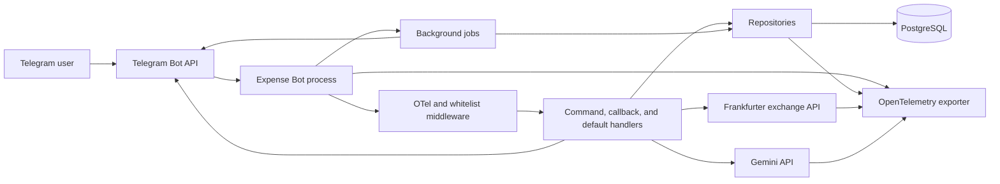
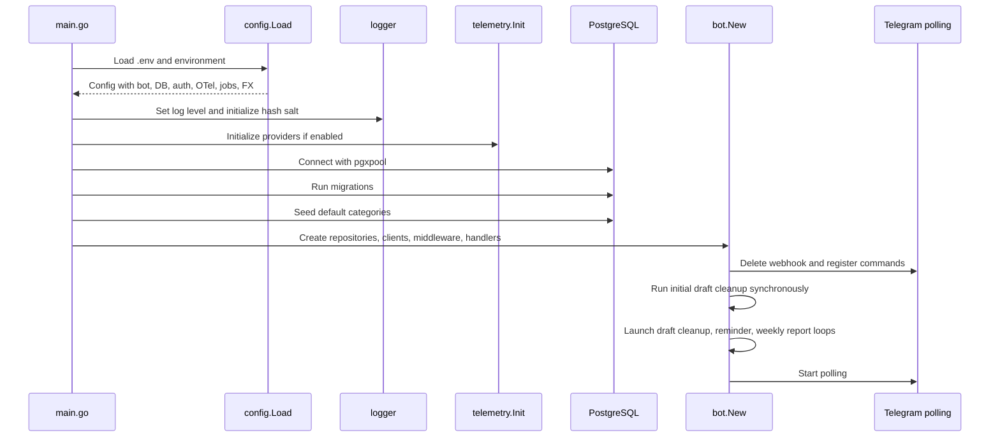
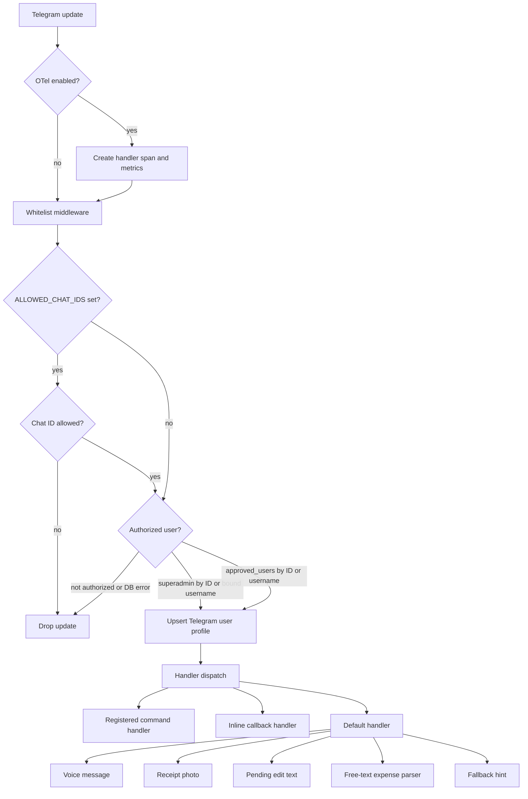
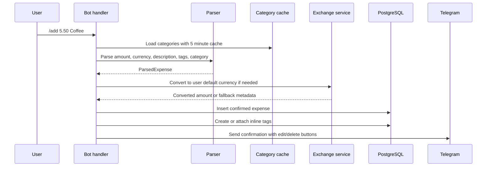
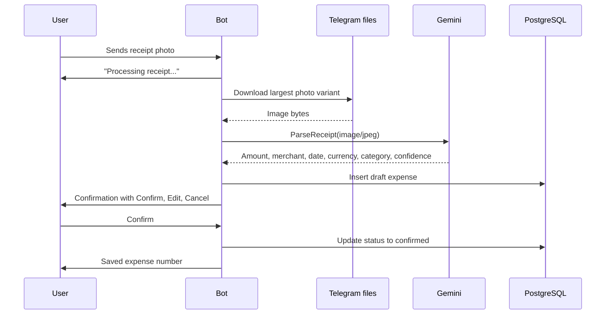
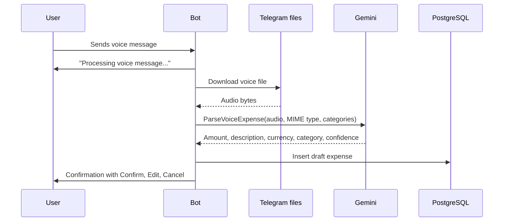
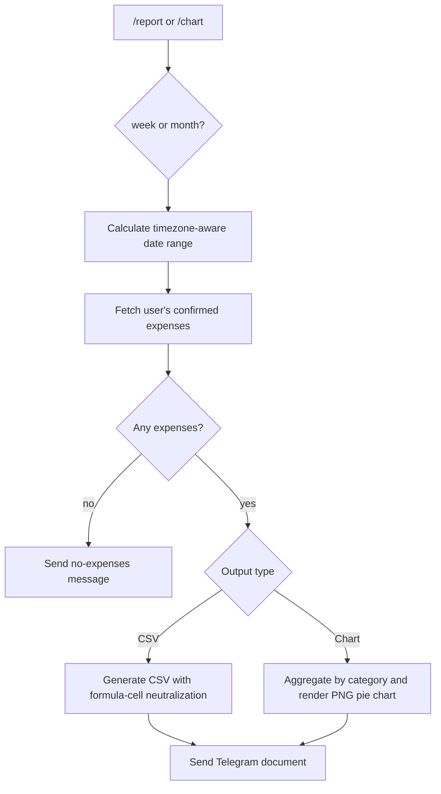
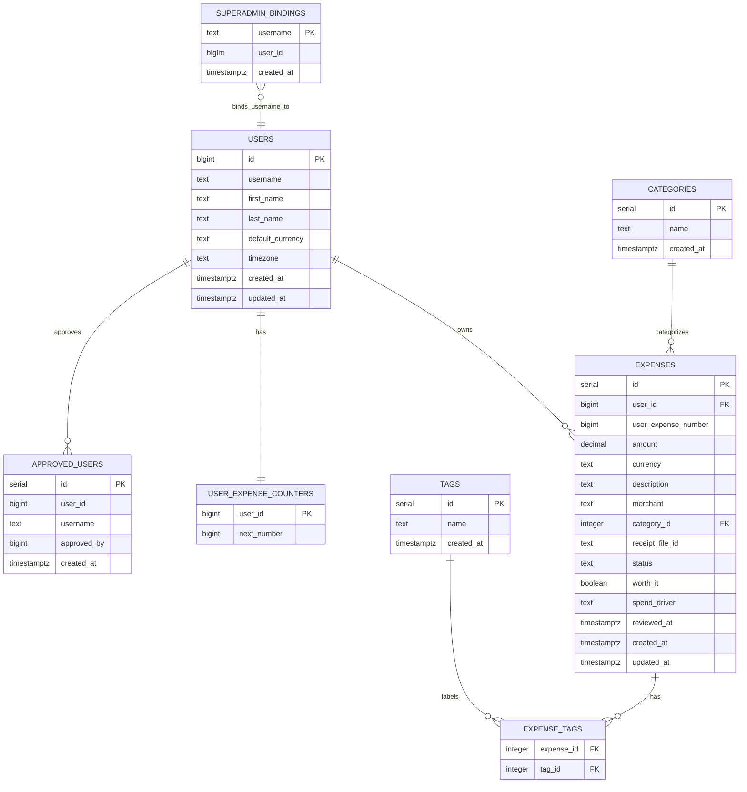

# How This Bot Works

The runtime architecture and main data flows, as implemented in `main.go`,
`internal/bot`, `internal/database`, `internal/gemini`, `internal/exchange`,
`internal/repository`, and `internal/telemetry`.

## High-Level Architecture

The bot is a long-running Telegram polling service. It receives Telegram
updates, authorizes the sender, routes commands or media to handlers, persists
expenses in PostgreSQL, optionally calls Gemini for receipt or voice parsing,
optionally calls Frankfurter for currency conversion, and emits logs, traces,
and metrics.



## Startup Sequence

`main()` creates a cancellable root context and calls `run()`. Startup is
fail-fast for required configuration and database setup: missing Telegram token,
database URL, or user whitelist prevents the process from running.



Key startup work:

- Configuration loads from environment and `.env`.
- Logger level and privacy hash salt are initialized.
- OpenTelemetry trace and metric providers are created when enabled.
- PostgreSQL migrations create or update all required tables, indexes, and the
  per-user expense-number trigger.
- Default categories are seeded idempotently.
- `bot.New` builds repositories, Gemini client, cached exchange service,
  HTTP client instrumentation, authorization middleware, and handlers.
- `Bot.Start` deletes the webhook, registers Telegram commands, runs one draft
  cleanup, starts background loops, and starts polling.

## Update Handling Pipeline

Every Telegram update passes through middleware before any handler runs. The
authorization layer is fail-closed: when database-backed authorization checks
error, the update is rejected instead of allowed.



Authorization sources:

- Superadmins come from `WHITELISTED_USER_IDS` and
  `WHITELISTED_USERNAMES`.
- Username-only superadmins are bootstrap entries. The first observed Telegram
  user ID is bound to the username and persisted in `superadmin_bindings` to
  reduce username-recycling risk.
- Dynamic approved users are stored in `approved_users` and managed by
  superadmins with `/approve`, `/revoke`, and `/users`.
- `ALLOWED_CHAT_IDS` optionally restricts which chats may use the bot.

## Command Surface

Handlers are registered in `internal/bot/bot.go`. The primary commands are:

- Expense entry: `/add`, plus free text such as `5.50 Coffee`.
- Expense management: `/edit`, `/delete`, inline edit/delete buttons.
- Views: `/list`, `/today`, `/week`, `/category`.
- Spending reflection: `/review` walks confirmed expenses one at a time and
  records whether each was worth it and why; `/habit` summarizes the recorded
  answers over a week, month, or 90 days.
- Reports: `/report week`, `/report month`, `/chart week`, `/chart month`.
- Categories: `/categories`, `/addcategory`, `/renamecategory`,
  `/deletecategory`.
- Currency: `/currency`, `/setcurrency`.
- Timezone: `/timezone`, `/settimezone`.
- Tags: inline `#tag`, `/tag`, `/untag`, `/tags`.
- Admin: `/approve`, `/revoke`, `/users`.
- Help and onboarding: `/start`, `/help`.

The default handler catches non-command messages. It handles voice, receipt
photos, pending edit replies, free-text expenses, and finally falls back to a
help message.

## Text Expense Flow

Text expense entry supports both `/add` and plain text. The parser accepts
amount-first and conservative description-first formats, currency symbols or
codes, bracket categories, suffix category matching, and inline tags.



Category assignment order for text expenses:

1. If the user explicitly supplies a known category, match it by
   case-insensitive exact name and use it.
2. If Gemini is configured and the description is non-empty, ask Gemini for a
   category suggestion.
3. If Gemini returns a matched category with confidence above `0.5`, apply it
   only when the suggested category exactly matches an existing category name
   case-insensitively.
4. If Gemini proposes a new category name with confidence at least `0.8`, create
   that category when it does not already exist, then assign it.
5. If no parsed or Gemini category is assigned, fall back to the seeded
   `Others` category. The richer `MatchCategory` fuzzy strategy is used here
   only to find that fallback category.
6. Leave the expense uncategorized only if the fallback category is missing.

Currency behavior:

- Users have a `default_currency`, defaulting to `SGD`.
- If no currency is parsed, the amount is saved in the user's default currency.
- If an input currency differs from the default, the exchange service converts
  it using Frankfurter rates.
- Exchange rates are cached in memory by currency pair for a configurable TTL,
  defaulting to 12 hours.
- If conversion fails, the bot saves the original currency and appends
  `fx_unavailable` metadata to the description.
- Successful conversions append original amount, converted amount, rate, and
  rate date metadata to the description.

## Receipt Photo Flow

Receipt OCR requires `GEMINI_API_KEY`. Without it, the bot tells the user to add
the expense manually.



Receipt and voice-created expenses are stored as `draft` first. The inline
keyboard lets the user:

- Confirm: update the draft to `confirmed`.
- Edit: change amount, merchant, or category. Description editing belongs to
  the post-add edit menu for confirmed expenses, not the draft edit menu.
- Cancel: delete the draft.
- Create category: add a new category, invalidate the category cache, and assign
  it to the draft.

Receipt-specific safety behavior:

- The bot downloads Telegram files through `downloadFile`, which enforces a
  10 MiB maximum response size.
- Gemini receipt parsing has a 30 second timeout.
- Receipt parsing uses Gemini's hardcoded `DefaultCategories` list and does not
  receive user-added categories.
- Partial extraction is allowed; the user sees a warning and must confirm or
  edit.
- Unknown merchants are saved as `Unknown merchant`.
- The Telegram receipt file ID is stored on the expense.

## Voice Expense Flow

Voice input also requires `GEMINI_API_KEY`. It follows the same draft
confirmation path as receipts.



Voice parsing uses a 15 second Gemini timeout. If the Telegram voice message has
no MIME type, the bot treats it as `audio/ogg`. If categories cannot be loaded,
the bot returns an error. If no categories exist, Gemini receives built-in
default categories.

## Reporting and Query Flows

The bot uses half-open date ranges, `[start, end)`, to avoid boundary overlap.
Week ranges start on Monday. `/today`, `/week`, `/report`, and `/chart` use the
configured display location, and per-user reminders use the user's stored
timezone when available.

Reporting flow:



Reports:

- `/report week` and `/report month` generate CSV files.
- CSV columns are user-visible expense number, date, amount, currency,
  description, merchant, category, and worth-it review state.
- CSV cells that could be interpreted as spreadsheet formulas are prefixed to
  neutralize formula injection.

Charts:

- `/chart week` and `/chart month` generate PNG pie charts.
- Chart values are aggregated by category, with uncategorized expenses grouped
  as `Uncategorized`.

Expense queries:

- `/list` shows recent expenses.
- `/today` and `/week` query date ranges and summarize matching expenses.
- `/category <name>` filters by category.
- `/tags` lists tags, and `/tags #name` filters expenses by tag.

## Data Model

PostgreSQL is the source of truth. Repositories in `internal/repository`
encapsulate database access for users, expenses, categories, tags, approvals,
and superadmin bindings.



Important data model details:

- `expenses.id` is the internal global identifier.
- `expenses.user_expense_number` is the user-facing ID shown in commands and
  messages. A database trigger assigns it per user when the row is inserted,
  including drafts. Cancelled drafts therefore leave gaps in the per-user
  sequence.
- `expenses.status` is `confirmed` for normal text expenses and `draft` for
  receipt or voice expenses awaiting confirmation.
- Deleting a category nullifies the category on existing expenses before the
  category is deleted.
- Tags are normalized to lowercase and connected to expenses through
  `expense_tags`.
- `worth_it`, `spend_driver`, and `reviewed_at` store the `/review`
  spending-reflection answers; `/habit` aggregates them.

## Background Jobs

`Bot.Start` launches three background behaviors:

- Draft cleanup runs immediately at startup and then every 5 minutes. It deletes
  `draft` expenses older than 10 minutes and records `background.drafts_cleaned`
  when metrics are enabled.
- Daily reminders run when `DAILY_REMINDER_ENABLED=true`. The loop checks
  immediately at startup, then every 30 minutes, and sends each authorized user
  at most one message per local day when their local hour matches
  `REMINDER_HOUR`. If the user has expenses today, it sends a daily summary;
  otherwise it sends a reminder to log expenses.
- Weekly reports run when `WEEKLY_REPORT_ENABLED=true`. The loop checks
  immediately at startup, then every 30 minutes, and sends the previous week's
  summary at most once per user/week when the user's local weekday and hour
  match `WEEKLY_REPORT_DAY` and `WEEKLY_REPORT_HOUR`. If the user had no
  expenses in the previous week, it sends nothing. When
  `WEEKLY_HABIT_RECAP_ENABLED=true`, the job also sends the previous week's
  spending-reflection recap, best-effort: a recap failure never blocks or
  re-sends the weekly summary.

Both reminder jobs fetch authorized users from the union of superadmins and
approved users. Per-user timezones come from `users.timezone`, falling back to
the configured display location when empty or invalid.

## External Integrations

Telegram:

- Polling is used; webhook state is deleted at startup without dropping pending
  updates.
- Command handlers respond with HTML-formatted Telegram messages.
- Reports and charts are sent as document uploads.
- Inline keyboards drive receipt confirmation and edit/delete actions.

Gemini:

- Used for category suggestions, receipt OCR, and voice expense parsing.
- Prompts and responses are sanitized before use.
- Category suggestion requests force JSON output and validate that matched
  categories come from the allowed list.
- Receipt and voice flows time out and return user-friendly fallback messages.

Exchange rates:

- Frankfurter is the concrete exchange API client.
- The base URL, HTTP timeout, and cache TTL are configurable.
- The cached exchange service deduplicates concurrent misses for the same
  currency pair and caches rates independently of the requested amount.

OpenTelemetry:

- When enabled, the app exports traces and metrics through OTLP gRPC, OTLP HTTP,
  or stdout.
- Database calls can be traced through `otelpgx`.
- Outbound HTTP can be instrumented.
- Handler middleware records Telegram handler counts, durations, and in-flight
  requests.
- Expense operations, expense amounts, background jobs, draft cleanup, and cache
  hits/misses are recorded as metrics.

## Failure and Safety Characteristics

- Required config is validated before polling starts.
- Authorization fails closed on database errors.
- Superadmin username bootstrap bindings are persisted to reduce username
  reuse risk.
- Receipt and voice features degrade to manual entry when Gemini is not
  configured.
- Exchange failures do not block saving an expense; the original currency is
  retained with metadata.
- Draft expenses are automatically removed if the user never confirms them.
- User-facing messages are HTML-escaped before interpolation.
- Logs avoid storing raw sensitive user content in the high-risk Gemini category
  path by using hashes and sanitization.

## Local Development Checks

The project uses `mise` tasks. For changes that affect bot behavior, run:

```bash
mise run test
mise run test-coverage
mise run test-race
mise run test-integration
```

Coverage is expected to stay at or above the CI threshold.
